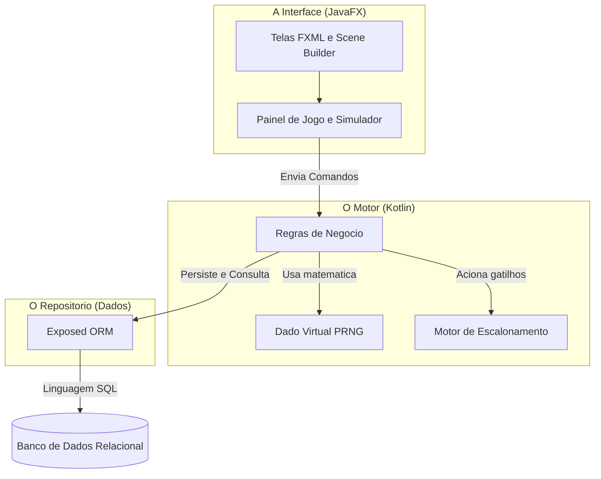
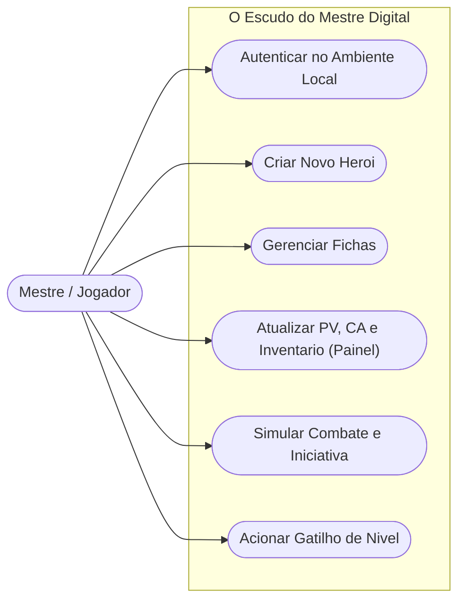
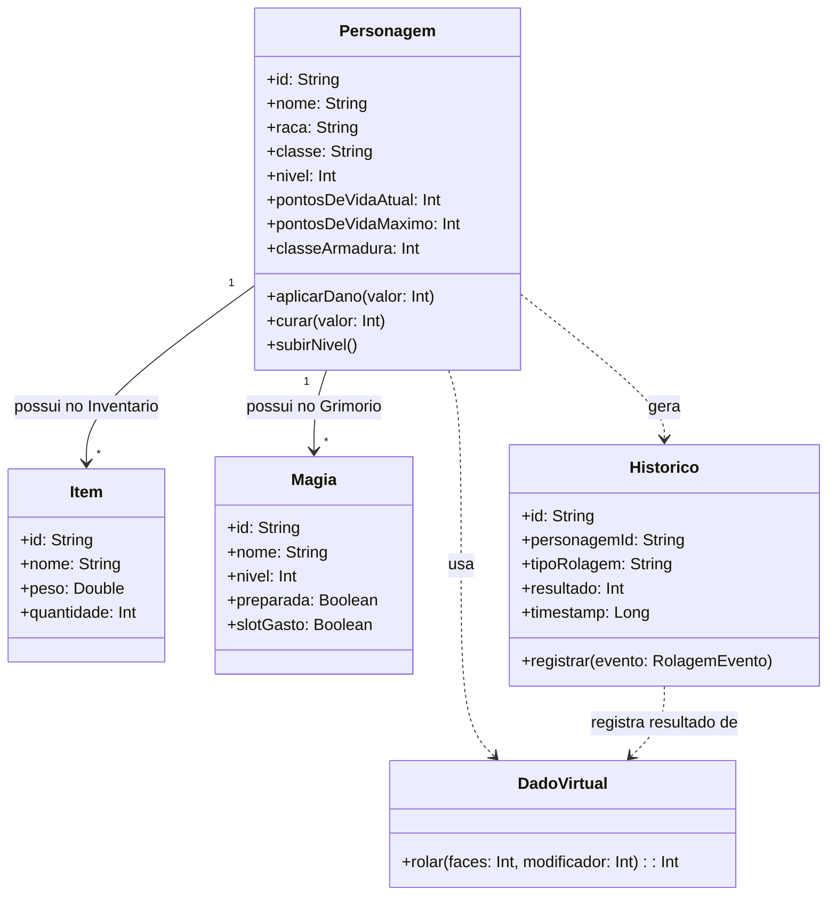
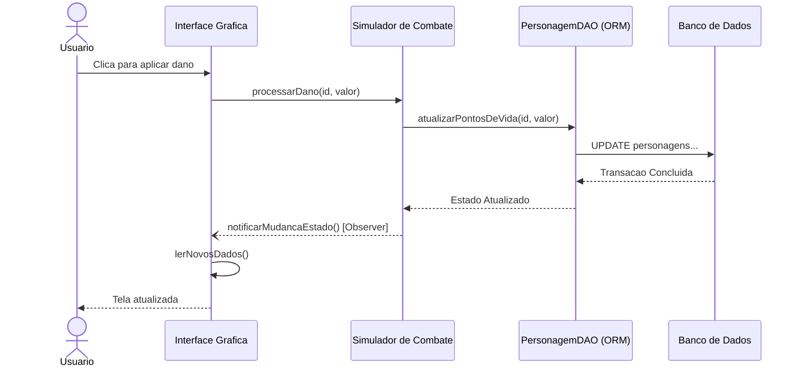
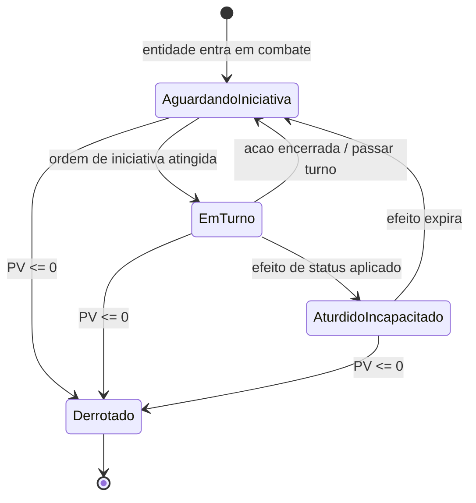

# O Escudo do Mestre Digital

### Sistema de Apoio à Condução de Campanhas de RPG de Mesa

**Documento de Requisitos e Projeto de Software**
Documento único de artefatos do processo de software — Especificação · Projeto · Desenvolvimento · Teste

| Disciplina | Equipe | Data do Projeto |
|---|---|---|
| Engenharia de Software | 6 alunos | 10/08/2026 |

Versão 1.2 · Revisão de completude — diagrama de estados, critérios de aceite e ajustes de rastreabilidade

**Alunos:** Mikael Menezes, Kaio Renato, João Filipe Rosa, Gustavo Afonso, Álvaro Neto, Saulo Ramos

---

## 1. Prefácio

Este documento constitui a especificação oficial do sistema "O Escudo do Mestre Digital", reunindo em um único artefato os produtos gerados ao longo do processo de Engenharia de Software: a definição dos requisitos de usuário, a especificação dos requisitos de sistema, o projeto arquitetural, os modelos comportamentais e estruturais, e o planejamento de verificação e validação (V&V). O documento foi elaborado para orientar de forma inequívoca o que deve ser implementado pela equipe de desenvolvimento.

Público-alvo: clientes representados por Mestres de RPG que utilizarão o sistema em suas mesas de jogo, também os jogadores da mesa. O documento tem três finalidades principais: (i) servir de base para o planejamento das atividades de desenvolvimento; (ii) fundamentar a elaboração dos testes de validação; e (iii) facilitar o entendimento do sistema por qualquer pessoa que venha a integrar a equipe no futuro.

### 1.1 Histórico de Versões

| Versão | Data | Descrição |
|---|---|---|
| v1.0 | 22/06/2026 | Definição inicial do escopo, dos requisitos de usuário e de sistema. |
| v1.1 | 05/07/2026 | Revisão arquitetural; migração da camada de persistência para o Exposed ORM; adoção da estrutura de modelagem de domínio (DDD); inclusão dos diagramas UML de caso de uso, classes, componentes e sequência. |
| v1.2 | 25/07/2026 | Revisão de completude: inclusão do diagrama de estados (7.4); correção do rótulo "Exposure ORM" para "Exposed ORM" no diagrama de componentes; quantificação da métrica de desempenho do RNF02; inclusão de requisitos não funcionais de usabilidade/interface (RNF04, RNF05); inclusão da classe Historico e conexão de DadoVirtual no diagrama de classes (7.2); inclusão de Histórias de Usuário com Critérios de Aceite em formato BDD (Seção 4.1). |

---

## 2. Introdução

O sistema "Escudo do Mestre Digital" visa apoiar Mestres de RPG na gestão de campanhas, automatizando o controle de combates, fichas, itens e magias. Mestres de jogos de interpretação de mesa frequentemente precisam conciliar múltiplas planilhas, cadernos e cálculos manuais durante uma sessão, o que aumenta a carga cognitiva e reduz o ritmo da narrativa. O sistema proposto centraliza essas informações em uma aplicação local, rápida e confiável.

Este sistema atende ao objetivo estratégico de fornecer uma plataforma local rápida e confiável, centralizando as informações e reduzindo a carga cognitiva do usuário durante o jogo. Ao automatizar rolagens, cálculos de dano e atualizações de estado, o Mestre pode concentrar sua atenção na narrativa e na condução da mesa, em vez de em operações aritméticas repetitivas.

### 2.1 Objetivos do Projeto

- Disponibilizar um ambiente único para criação, edição e consulta de fichas de personagens, monstros e itens.
- Automatizar o cálculo de rolagens de ataque, dano e demais testes de resolução de ações.
- Registrar o histórico de rolagens realizadas em sessão, permitindo auditoria e replay das decisões de mesa.
- Garantir persistência local dos dados, sem dependência de conexão externa, através de um banco de dados embarcado.
- Estruturar o software de forma desacoplada, permitindo evolução futura para um modelo distribuído (multiusuário/online).

### 2.2 Escopo

O escopo da primeira versão do sistema compreende o gerenciamento local de fichas de personagens, itens e magias, o motor de cálculo de combate (incluindo rolagens com vantagem/desvantagem) e a persistência local via SQLite. Está fora do escopo desta versão qualquer funcionalidade de sincronização em nuvem, jogo em rede entre múltiplos dispositivos ou marketplace de conteúdo, ainda que a arquitetura tenha sido desenhada para viabilizar essa evolução.

---

## 3. Glossário

Para evitar suposições sobre a experiência do leitor, os seguintes termos técnicos são definidos:

| Termo | Definição |
|---|---|
| PRNG | Pseudo-Random Number Generator (Gerador de Números Pseudoaleatórios), utilizado para simular a rolagem de dados virtuais. |
| CA (Classe de Armadura) | Atributo de jogo que define a dificuldade de acertar um ataque em uma entidade. |
| Exposed ORM | Object-Relational Mapping (Mapeamento Objeto-Relacional) escrito em Kotlin para acesso ao banco de dados. |
| DDD (Domain-Driven Design) | Abordagem de modelagem de software focada no domínio do problema. |
| PV (Pontos de Vida) | Atributo numérico que representa a integridade física de uma entidade em combate. |
| MVC | Model-View-Controller, padrão arquitetural que separa dados, apresentação e lógica de controle. |
| BDD (Behavior-Driven Design) | Técnica de especificação de comportamento por meio de cenários em linguagem natural estruturada (Dado/Quando/Então), usada para orientar o TDD. |

---

## 4. Requisitos de Usuário

Descrições abstratas e em linguagem natural dos serviços oferecidos, escritas de forma compreensível para os Mestres de RPG, sem jargões técnicos.

| Código | Descrição |
|---|---|
| RU01 | O sistema deve permitir que o Mestre crie, edite e visualize fichas de personagens, monstros e itens. |
| RU02 | O sistema deve realizar cálculos automáticos de rolagens de ataque e dano durante o combate. |
| RU03 | O sistema pode exibir um registro (histórico) das últimas rolagens realizadas na sessão. |

### 4.1 Histórias de Usuário e Critérios de Aceite

> **Correção v1.2** — seção nova. Os requisitos de usuário RU01–RU03 foram desdobrados em Histórias de Usuário com Critérios de Aceite no formato BDD (Dado/Quando/Então), servindo de base direta para os testes automatizados de TDD (Seção 8.1).

#### História de Usuário 1 — Gerenciar Fichas (RU01)

Como Mestre de RPG, eu quero criar, editar e visualizar fichas de personagens, monstros e itens, para que eu possa preparar e conduzir minhas sessões sem depender de planilhas externas.

**Critério de Aceite 1.1 — Criação de ficha válida**
- **Dado que** o Mestre está na tela "Gerenciar Fichas" e preenche nome, raça, classe e atributos obrigatórios de um novo personagem;
- **Quando** o Mestre confirma a criação;
- **Então** o sistema persiste a ficha via Exposed ORM e a exibe imediatamente na lista de personagens, com id gerado automaticamente.

**Critério de Aceite 1.2 — Edição de ficha existente**
- **Dado que** existe uma ficha de personagem previamente salva;
- **Quando** o Mestre altera um atributo (ex.: pontosDeVidaMaximo) e salva;
- **Então** o sistema atualiza o registro correspondente no banco local e reflete a alteração em qualquer painel aberto que exiba aquele personagem.

**Critério de Aceite 1.3 — Validação de dados obrigatórios**
- **Dado que** o Mestre tenta criar uma ficha sem preencher o campo nome;
- **Quando** o Mestre confirma a criação;
- **Então** o sistema rejeita a operação e exibe uma mensagem indicando o campo obrigatório ausente, sem gravar registro incompleto.

#### História de Usuário 2 — Rolagens de Ataque e Dano (RU02)

Como Mestre de RPG, eu quero que o sistema calcule automaticamente rolagens de ataque e dano, para que eu possa manter o ritmo do combate sem interromper a narrativa com cálculos manuais.

**Critério de Aceite 2.1 — Rolagem simples**
- **Dado que** um personagem possui um modificador de ataque definido;
- **Quando** o Mestre aciona "Rolar Ataque" para esse personagem;
- **Então** o sistema invoca DadoVirtual.rolar(), soma o modificador do personagem e exibe o resultado final na interface.

**Critério de Aceite 2.2 — Vantagem e desvantagem**
- **Dado que** uma rolagem é marcada com vantagem;
- **Quando** o Mestre executa a rolagem;
- **Então** o motor de regras executa duas rolagens do PRNG e retorna o maior valor entre elas (o inverso — o menor valor — se marcada como desvantagem).

**Critério de Aceite 2.3 — Aplicação de dano em tempo real**
- **Dado que** um personagem está com pontosDeVidaAtual acima de zero;
- **Quando** o Mestre aplica um valor de dano resultante da rolagem;
- **Então** o sistema atualiza pontosDeVidaAtual, persiste a alteração e notifica a interface via padrão Observer dentro do limite definido no RNF02.

#### História de Usuário 3 — Histórico de Rolagens (RU03)

Como Mestre de RPG, eu quero consultar um histórico das últimas rolagens da sessão, para que eu possa auditar decisões de mesa e resolver disputas sobre resultados.

**Critério de Aceite 3.1 — Registro automático de rolagem**
- **Dado que** uma rolagem de ataque, dano ou magia é executada;
- **Quando** o resultado é calculado pelo motor de regras;
- **Então** o sistema cria automaticamente um registro em Historico contendo personagemId, tipoRolagem, resultado e timestamp, sem exigir ação manual do Mestre.

**Critério de Aceite 3.2 — Consulta do histórico da sessão**
- **Dado que** existem registros de Historico gravados na sessão corrente;
- **Quando** o Mestre abre o painel de histórico;
- **Então** o sistema lista as rolagens em ordem cronológica decrescente, permitindo identificar personagem, tipo de rolagem e resultado de cada evento.

---

## 5. Requisitos de Sistema

Descrições detalhadas do que o sistema deve fazer, voltadas para a equipe de desenvolvimento.

### 5.1 Requisitos Funcionais

Serviços e reações do sistema:

| Código | Descrição |
|---|---|
| RF01 | O sistema deve fornecer uma interface de repositório para realizar operações CRUD nas tabelas de Ficha, Item e Magia via Exposed ORM. |
| RF02 | O motor de cálculo do sistema deve processar modificadores de atributos e aplicar lógicas de vantagem/desvantagem nos resultados do PRNG. |
| RF03 | O sistema deve registrar automaticamente, na entidade Historico, cada rolagem executada (ataque, dano ou magia), associando personagemId, tipoRolagem, resultado e timestamp. |

> RF03 é um requisito novo, adicionado para dar suporte formal ao RU03 e à classe Historico incluída no modelo estrutural (Seção 7.2).

### 5.2 Requisitos Não Funcionais

Restrições operacionais e de processo:

| Código | Categoria | Descrição |
|---|---|---|
| RNF01 | Processo / Desenvolvimento | O sistema deve ser desenvolvido utilizando a linguagem Kotlin e o ecossistema Gradle. |
| RNF02 | Desempenho | A atualização dos Pontos de Vida (PV) deve ser refletida na interface em, no máximo, 200 ms após o clique do Mestre, medidos do evento de UI até a notificação via padrão Observer, em hardware de referência (SSD, 8 GB RAM). |
| RNF03 | Físico | Os dados devem ser armazenados localmente utilizando banco de dados SQLite. |
| RNF04 | Usabilidade / Interface | A interface JavaFX deve ser utilizável em resoluções a partir de 1366×768 px, com os elementos do Painel de Jogo redimensionáveis sem sobreposição de componentes. |
| RNF05 | Usabilidade / Interface | As ações mais frequentes de mesa (rolar ataque, rolar dano, aplicar dano ao personagem selecionado) devem possuir atalhos de teclado configuráveis, reduzindo a dependência do mouse durante o combate. |

> RNF02 foi quantificado (antes: "limites aceitáveis", sem métrica). RNF04 e RNF05 são novos, cobrindo a lacuna de requisitos de interface/usabilidade apontada na revisão.

---

## 6. Arquitetura do Sistema

O projeto arquitetural adota o Modelo de Visões 4+1, proposto por Philippe Kruchten, para descrever e documentar a arquitetura sob diferentes perspectivas complementares, cada uma voltada a um conjunto de interessados no sistema.

### 6.1 Visão Lógica

Focada nas abstrações do sistema (objetos e classes), utilizando a modelagem de domínio DDD (Entidades, Objetos de Valor e Repositórios). As classes Personagem, Item e Magia representam as entidades centrais do domínio, enquanto o Dado Virtual atua como serviço de domínio responsável pela geração de números pseudoaleatórios. A entidade Historico complementa essa visão, registrando os eventos de rolagem como parte do domínio (ver Seção 7.2).

### 6.2 Visão de Processo

Ilustra como o sistema reage em tempo de execução, como as atualizações de interface no controle de Pontos de Vida em tempo real e os cálculos de rolagens. Esta visão evidencia a comunicação assíncrona entre a camada de apresentação e o motor de regras através do padrão Observer.

### 6.3 Visão de Desenvolvimento

Descreve a estrutura de pacotes da linguagem Kotlin e a organização dos módulos no Gradle, separando claramente a camada de interface (JavaFX), o motor de regras (Kotlin puro) e o repositório de dados (Exposed ORM).

### 6.4 Visão Física

Mapeia a distribuição do sistema, executado localmente via um arquivo JAR conectado a um driver de banco de dados SQLite, sem dependência de infraestrutura de rede.

### 6.5 Padrões Adotados

O uso do padrão MVC (Model-View-Controller) guia a separação entre os dados do RPG, a interface do usuário e o motor lógico de interação. Complementarmente, o padrão Observer é empregado para notificar a interface gráfica sempre que o estado de uma entidade é alterado pelo motor de regras.

### 6.6 Diagrama de Componentes

O diagrama a seguir apresenta a organização dos três grandes subsistemas do Escudo do Mestre Digital — a Interface (JavaFX), o Motor (Kotlin) e o Repositório (Dados) — e o fluxo de dependências entre eles.

> **Correção v1.2** — o rótulo do componente de persistência foi corrigido de "Exposure ORM" para "Exposed ORM", alinhando o diagrama ao texto e ao Glossário (Seção 3).

*Figura 1 – Diagrama de componentes da arquitetura em camadas (nomenclatura corrigida).*

---

## 7. Modelos do Sistema

A modelagem detalhada apoia o entendimento do projeto com a adoção de diagramas UML, cobrindo as visões estrutural, comportamental e de interação do sistema.

### 7.1 Diagrama de Casos de Uso

Representa as principais interações entre o ator Mestre/Jogador e as funcionalidades oferecidas pelo sistema, desde a autenticação no ambiente local até o acionamento de gatilhos de nível durante a evolução dos personagens.

*Figura 2 – Diagrama de casos de uso do Mestre/Jogador.*

### 7.2 Diagrama de Classes (Modelo Estrutural)

Mostra as classes constituintes (Personagem, Item, Magia, Dado Virtual) e seus relacionamentos, bem como o mapeamento dessas entidades para o banco de dados via Exposed ORM. A classe Personagem concentra os atributos de jogo e os comportamentos de aplicar dano, curar e subir de nível, relacionando-se em cardinalidade um-para-muitos com Item e Magia.

> **Correção v1.2** — o diagrama foi ampliado com a classe Historico (suporte a RU03/RF03) e com as dependências que antes deixavam DadoVirtual isolado: Personagem usa DadoVirtual para gerar rolagens, e Historico registra os resultados retornados por DadoVirtual.

*Figura 3 – Diagrama de classes do domínio Personagem, Item, Magia, DadoVirtual e Historico.*

### 7.3 Diagrama de Sequência (Modelo de Interação)

Documenta o fluxo dinâmico e temporal de uma "Rolagem de Ataque" ou "Gasto de Espaço de Magia", evidenciando a troca de mensagens entre o usuário, o controlador, o simulador de combate, o repositório (PersonagemDAO) e o banco de dados. O diagrama a seguir ilustra o cenário de aplicação de dano, no qual a interface notifica o simulador de combate, que por sua vez delega a persistência ao ORM e recebe, via padrão Observer, a notificação de que o estado foi atualizado.

*Figura 4 – Diagrama de sequência do fluxo "Aplicar Dano".*

### 7.4 Diagrama de Estados

Ilustra o ciclo de vida e a transição de estados das entidades durante os turnos de um combate, contemplando os estados Aguardando Iniciativa, Em Turno, Aturdido/Incapacitado e Derrotado, com as transições disparadas pelos eventos do motor de regras.

> **Correção v1.2** — diagrama ausente na versão 1.1 (apenas descrito em texto). Adicionado abaixo, cobrindo os quatro estados mínimos exigidos e suas transições, incluindo a transição direta para Derrotado a partir de qualquer estado quando pontosDeVidaAtual chega a zero.

*Figura 5 – Diagrama de estados do ciclo de vida de uma entidade em combate.*

---

## 8. Validação e Planejamento de Testes

O plano de testes define o cronograma e as estratégias para garantir a Verificação e Validação (V&V) do sistema, assegurando que o software construído corresponde tanto às especificações técnicas quanto às expectativas reais dos Mestres de RPG.

### 8.1 Desenvolvimento Dirigido a Testes (TDD)

A equipe escreve testes automatizados concomitantemente com o código, garantindo cobertura para as regras de negócio, especialmente para o motor de cálculo de rolagens e a aplicação de modificadores de vantagem/desvantagem. Os Critérios de Aceite em formato BDD definidos na Seção 4.1 servem de insumo direto para a escrita desses testes, um por critério.

### 8.2 Teste Unitário

São escritos testes focados no motor de regras e algoritmos de PRNG, verificando a correta distribuição dos resultados de rolagem e a aplicação dos modificadores de atributos.

### 8.3 Teste de Sistema/Integração

Validação da persistência de dados simulando fluxos de leitura e gravação com o framework Exposed nas tabelas SQLite, garantindo a integridade referencial entre Personagem, Item, Magia e Historico.

### 8.4 Inspeções

Realização de análises estáticas e revisões no código Kotlin e na especificação de requisitos para detecção precoce de erros, incluindo revisões de pares antes da integração de cada funcionalidade ao ramo principal do repositório.

### 8.5 Matriz de Rastreabilidade (síntese)

| Requisito | Estratégia de Verificação |
|---|---|
| RU01 / RF01 | Teste de integração sobre as operações CRUD do repositório Exposed; Critérios de Aceite 1.1–1.3. |
| RU02 / RF02 | Teste unitário do motor de cálculo, com casos de borda para vantagem/desvantagem; Critérios de Aceite 2.1–2.3. |
| RU03 / RF03 | Teste de sistema validando o registro cronológico das rolagens em sessão na entidade Historico; Critérios de Aceite 3.1–3.2. |
| RNF02 | Teste de desempenho medindo o tempo de resposta da atualização de PV em tempo real (limite: 200 ms). |
| RNF03 | Teste de integração validando a persistência local em SQLite. |
| RNF04 / RNF05 | Inspeção de usabilidade em resoluções mínimas suportadas e verificação manual dos atalhos de teclado configuráveis. |

---

## 9. Evolução do Sistema

O sistema pressupõe a possibilidade de alterações futuras. Graças ao forte desacoplamento provido pela arquitetura DDD e pelo mapeamento relacional (ORM), o Escudo do Mestre Digital está preparado para evoluir para um ambiente de software distribuído (multiusuário/online) ou para a rápida integração de novos pacotes e expansões de regras de diferentes sistemas de RPG.

Entre as evoluções previstas para versões futuras, destacam-se: sincronização de fichas entre múltiplos dispositivos em uma mesma mesa, suporte a sistemas de RPG alternativos por meio de pacotes de regras plugáveis, e um modo online que preserve a mesma camada de domínio já validada nesta versão local.

---

## 10. Conclusão

Este documento consolidou, em um único artefato, as etapas de especificação de requisitos, projeto arquitetural, modelagem UML e planejamento de testes do sistema "O Escudo do Mestre Digital", atendendo à proposta de contemplar as principais etapas dos processos de software. A separação entre requisitos de usuário e de sistema, a aplicação do Modelo de Visões 4+1 e a adoção de DDD e TDD conferem ao projeto rastreabilidade entre a necessidade do Mestre de RPG e a implementação técnica em Kotlin, preparando o sistema tanto para a entrega imediata quanto para sua evolução futura.
